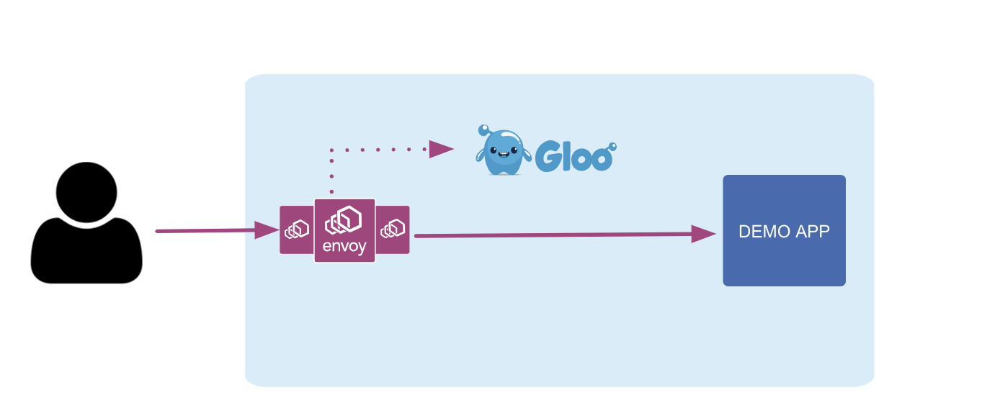
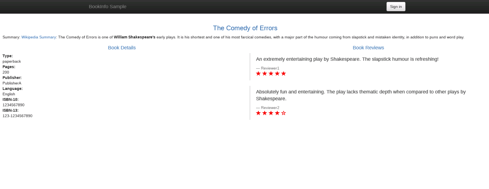
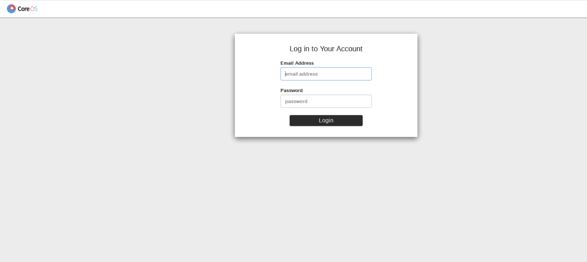
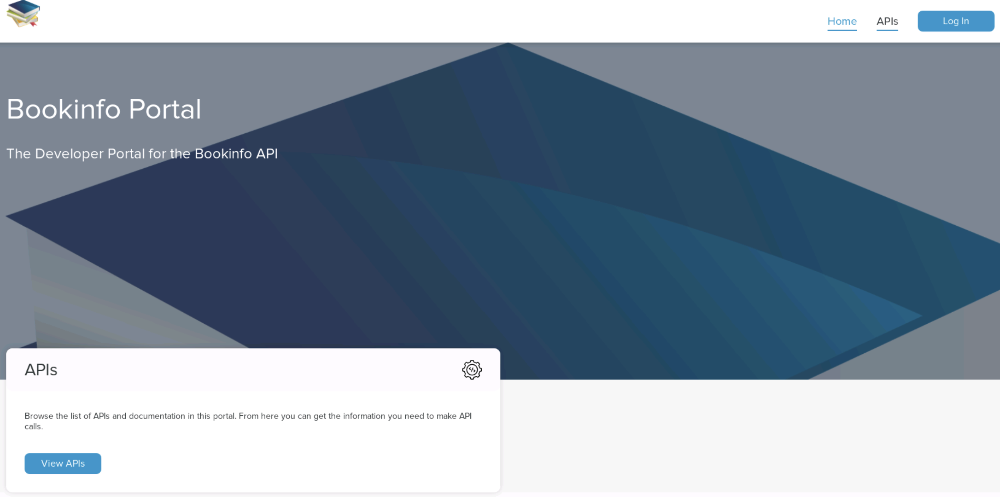

# Gloo Workshop

Gloo is a feature-rich, Kubernetes-native ingress controller, and next-generation API gateway. Gloo is exceptional in its function-level routing; its support for legacy apps, microservices and serverless; its discovery capabilities; its numerous features; and its tight integration with leading open-source projects. Gloo is uniquely designed to support hybrid applications, in which multiple technologies, architectures, protocols, and clouds can coexist.

The goal of this workshop is to expose some key features of Gloo API Gateway, like traffic management, security, and API management.

## Lab Environment

The following Lab environment consists of a Kubernetes environment deployed locally using kind, during this workshop we are going to deploy a demo application and expose/protect it using Gloo.
In this workshop we will:
* Deploy a demo application (Istio's [bookinfo](https://istio.io/latest/docs/examples/bookinfo/) demo app) on a k8s cluster and expose it through Gloo
* Deploy a second version of the demo app, and route partial traffic to it
* Secure the demo app using TLS
* Secure the demo app using OIDC
* Rate limit the traffic going to the demo app
* Transform a response using Gloo transformations
* Configure access logs




## Lab 0: Demo Environment Creation

Go the folder `/home/solo/workshops/gloo/gloo` directory using the terminal

```
cd /home/solo/workshops/gloo/gloo
```

### Create a Kubernetes Cluster

Deploy a local Kubernetes cluster using this command:
```bash
../../scripts/deploy.sh 1 gloo
```

Then verify that your Kubernetes cluster is ready to be used: 
```bash
../../scripts/check.sh gloo
```

### Install Gloo 
```bash
kubectl config use-context gloo
glooctl upgrade --release=v1.5.0
glooctl install gateway enterprise --version 1.5.0 --license-key $LICENSE_KEY
```

Use the following commands to wait for the Gloo components to be deployed:

```bash
until kubectl get ns gloo-system
do
  sleep 1
done

until [ $(kubectl -n gloo-system get pods -o jsonpath='{range .items[*].status.containerStatuses[*]}{.ready}{"\n"}{end}' | grep false -c) -eq 0 ]; do
  echo "Waiting for all the gloo-system pods to become ready"
  sleep 1
done
```

## Lab 1: Traffic Management

### Routing to a Kubernetes Service 

In this step we will expose a demo service to the outside world using Gloo.
First let's create a demo applications called bookinfo: 
 
```
                 +----------------------------------------------------------------------------+
                 |                                                                            |
                 |                                         +---------------+                  |
                 |                                         |-------+       |                  |
                 +-------+                                 ||Product       |                  |
+-Client-------->+  Envoy+-------------------------------->-|Page  |       |                  |
                 +---+---+                                 +-------+       |                  |
                 |   |                                     |Bookinfo       |                  |
                 |   |                                     +v2             |                  |
                 |   |                                     +---------------+                  |
                 |   |                                                                        |
                 |   |                                                                        |
                 |   |                                                                        |
                 | +-v-------+                                                                |
                 | |  Gloo   |                                                                |
                 | |         |                                                                |
                 | +---------+                                                                |
                 |                                                                            |
                 |Kubernetes                                                                  |
                 +----------------------------------------------------------------------------+


```

```bash
kubectl create ns bookinfo 
kubectl -n bookinfo  apply -f https://raw.githubusercontent.com/istio/istio/1.7.3/samples/bookinfo/platform/kube/bookinfo.yaml
kubectl delete deployment reviews-v1 reviews-v3 -n bookinfo
```
The bookinfo app has 3 versions of a microservice called reviews.  We will keep only version 2 of the reviews microservice for this tutorial, and we will add the other versions later.  An easy way to distinguish among the different versions in the web interface is that v1 shows no stars with its reviews, v2 shows black stars, and v3 shows red stars.


Gloo uses a discovery mechanism to create Upstreams automatically, but Upstreams can be created manually too using CRDs.
After a few seconds, Gloo will discover the newly created service and create a corresponding Upstream called  **bookinfo-productpage-9080** (Gloo uses the convention `namespace-service-port` for naming automatically discovered Upstreams).

To verify that the Upstream was created properly, run the following command: 

```bash
until glooctl get upstream bookinfo-productpage-9080 2> /dev/null
do
    echo waiting for upstream bookinfo-productpage-9080 to be discovered
    sleep 3
done
```

It should return the discovered upstream with an `Accepted` status: 

```
+---------------------------+------------+----------+----------------------------+
|         UPSTREAM          |    TYPE    |  STATUS  |          DETAILS           |
+---------------------------+------------+----------+----------------------------+
| bookinfo-productpage-9080 | Kubernetes | Accepted | svc name:      productpage |
|                           |            |          | svc namespace: bookinfo    |
|                           |            |          | port:          9080        |
|                           |            |          |                            |
+---------------------------+------------+----------+----------------------------+
```

Now that the upstream CRD has been created, we need to create a Gloo virtual service that routes traffic to the upstream:

```bash
kubectl apply -f - <<EOF
apiVersion: gateway.solo.io/v1
kind: VirtualService
metadata:
  name: demo
  namespace: gloo-system
spec:
  virtualHost:
    domains:
      - '*'
    routes:
      - matchers:
          - prefix: /
        routeAction:
          single:
            upstream:
              name: bookinfo-productpage-9080
              namespace: gloo-system
EOF
```

The creation of the virtual service exposes the Kubernetes service through the gateway.

We can make access the application using the web browser by running the following command:

```
chrome $(glooctl proxy url)/productpage
```

It should return the bookinfo demo application webpage. Note that the review stars are black. 


### Routing to Multiple Upstreams

In many use cases we need to route traffic to two different versions of the application to test a new feature. For example, in this step, we are going to create a virtual service that routes to two different Upstreams:

The first step is to create a version 3 of our demo service: 

```bash
kubectl create ns bookinfo-beta 
kubectl -n bookinfo-beta apply -f https://raw.githubusercontent.com/istio/istio/1.7.3/samples/bookinfo/platform/kube/bookinfo.yaml
kubectl delete deployment reviews-v1 reviews-v2 -n bookinfo-beta
```
The bookinfo app has 3 versions of a microservice called reviews.  We will keep only version 3 of the reviews microservice for this application deployment.

```
                 +----------------------------------------------------------------------------+
                 |                                                                            |
                 |                                         +---------------+                  |
                 |                                         |-------+       |                  |
                 +-------+            50%                  ||Product       |                  |
+-Client-------->+  Envoy+-------------------------------->-|Page  |       |                  |
                 |       |            50%                  +-------+       |                  |
                 |       +----------------------------+    |Bookinfo       |                  |
                 +---+---+                            |    +v2             |                  |
                 |   |                                |    +---------------+                  |
                 |   |                                |                                       |
                 |   |                                |    +---------------+                  |
                 |   |                                |    |-------+       |                  |
                 | +-v-------+                        +--->-|Product       |                  |
                 | |  Gloo   |                             ||Page  |       |                  |
                 | |         |                             +-------+       |                  |
                 | +---------+                             |Bookinfo beta  |                  |
                 |                                         +v3             |                  |
                 |Kubernetes                               |---------------+                  |
                 +----------------------------------------------------------------------------+

```

Verify that the Upstream for the beta application was created, using the following command: 


```bash
until glooctl get upstream bookinfo-beta-productpage-9080 2> /dev/null
do
    echo waiting for upstream bookinfo-beta-productpage-9080 to be discovered
    sleep 3
done
```

Now we can route to multiple Upstreams by creating the following Virtual Service CRD: 

```bash
kubectl apply -f - <<EOF
apiVersion: gateway.solo.io/v1
kind: VirtualService
metadata:
  name: demo
  namespace: gloo-system
spec:
  virtualHost:
    domains:
      - '*'
    routes:
      - matchers:
          - prefix: /
        routeAction:
        # ----------------------- Multi Destination ----------------------
            multi:
                destinations:
                - weight: 5
                  destination:
                      upstream:
                          name: bookinfo-productpage-9080
                          namespace: gloo-system
                - weight: 5
                  destination:
                      upstream:
                          name: bookinfo-beta-productpage-9080
                          namespace: gloo-system
EOF
```

To check that Gloo is routing to the two different Upstreams (50% traffic each), we are going to use the browser.
We should see the black star (v2) reviews, and the new red star reviews (v3) after refreshing the page:  

```
chrome $(glooctl proxy url)/productpage 
```



## Lab 2: Security
In this chapter, we will explore some Gloo features related to security. 

### Network Encryption - Server TLS

In this step we are going to secure our demo application using TLS.
Let's first create a private key and a self-signed certificate to use in our demo Virtual Service:

```bash
openssl req -x509 -nodes -days 365 -newkey rsa:2048 \
   -keyout tls.key -out tls.crt -subj "/CN=*"
```

Then we have store them as a secret in Kubernetes running the following command:
```bash
kubectl create secret tls upstream-tls --key tls.key \
   --cert tls.crt --namespace gloo-system
```

To setup Server TLS we have to add the SSL config to the Virtual Service:

```bash
kubectl apply -f - <<EOF
apiVersion: gateway.solo.io/v1
kind: VirtualService
metadata:
  name: demo
  namespace: gloo-system
spec:
  # The SSL config below activate TLS on the Virtual Service
  # ------------
  sslConfig:
    secretRef:
      name: upstream-tls
      namespace: gloo-system
  # ------------    
  virtualHost:
    domains:
      - '*'
    routes:
      - matchers:
          - prefix: /
        routeAction:
            multi:
                destinations:
                - weight: 5
                  destination:
                      upstream:
                          name: bookinfo-productpage-9080
                          namespace: gloo-system
                - weight: 5
                  destination:
                      upstream:
                          name: bookinfo-beta-productpage-9080
                          namespace: gloo-system
EOF
```

Now the gateway is secured through TLS. To test the TLS configuration, run the following command to open the browser (note that now the traffic is served using https): 

```
chrome $(glooctl proxy url --port https)/productpage 

```

### OIDC Support

In many use cases, we need to restrict the access to our applications to authenticated users. In the following chapter we will secure our application using an OIDC Identity Provider.

Let's start by installing the open-source [Dex](https://landscape.cncf.io/selected=dex) IdP on our cluster:
 
```bash
cat > dex-values.yaml <<EOF
service:
    type: LoadBalancer
config:
  # The base path of dex and the external name of the OpenID Connect service.
  # This is the canonical URL that all clients MUST use to refer to dex. If a
  # path is provided, dex's HTTP service will listen at a non-root URL.
  issuer: http://dex.gloo-system.svc.cluster.local:32000

  # Instead of reading from an external storage, use this list of clients.
  staticClients:
  - id: gloo
    redirectURIs:
    - "$(glooctl proxy url --port https)/callback"
    name: 'GlooApp'
    secret: secretvalue
  
  # A static list of passwords to login the end user. By identifying here, dex
  # won't look in its underlying storage for passwords.
  staticPasswords:
  - email: "admin@example.com"
    # bcrypt hash of the string "password"
    hash: "\$2a\$10\$2b2cU8CPhOTaGrs1HRQuAueS7JTT5ZHsHSzYiFPm1leZck7Mc8T4W"
    username: "admin"
    userID: "08a8684b-db88-4b73-90a9-3cd1661f5466"
    
  - email: "admin@beta.com"
    # bcrypt hash of the string "password"
    hash: "\$2a\$10\$2b2cU8CPhOTaGrs1HRQuAueS7JTT5ZHsHSzYiFPm1leZck7Mc8T4W"
    username: "guest"
    userID: "28a8684b-db88-4b73-90a9-3cd1661f5466"

  - email: "guest@other.com"
    # bcrypt hash of the string "password"
    hash: "\$2a\$10\$2b2cU8CPhOTaGrs1HRQuAueS7JTT5ZHsHSzYiFPm1leZck7Mc8T4W"
    username: "external"
    userID: "18a8684b-db88-4b73-90a9-3cd1661f5466"

EOF
```

```bash
helm repo add stable https://kubernetes-charts.storage.googleapis.com
helm install dex --namespace gloo-system stable/dex -f dex-values.yaml
```

The architecture looks like this now:

```
                 +----------------------------------------------------------------------------+
                 |                                                                            |
                 |                                         +---------------+                  |
                 |                                         |-------+       |                  |
                 +-------+            50%                  ||Product       |                  |
+-Client-------->+  Envoy+-------------------------------->-|Page  |       |                  |
                 |       |            50%                  +-------+       |                  |
                 |       +----------------------------+    |Bookinfo       |                  |
                 +---+---------------------+          |    +v2             |                  |
                 |   |                     |          |    +---------------+                  |
                 |   |                    Auth        |                                       |
                 |   |                     |          |    +---------------+                  |
                 |   |                     |          |    |-------+       |                  |
                 | +-v-------+             |          +--->-|Product       |                  |
                 | |  Gloo   |        +----v-----+         ||Page  |       |                  |
                 | |         |        |          |         +-------+       |                  |
                 | +---------+        |   IDP    |         |Bookinfo beta  |                  |
                 |                    +----------+         +v3             |                  |
                 |Kubernetes                               |---------------+                  |
                 +----------------------------------------------------------------------------+


```


Let's save the Dex IP in an environment variable for future use:

```bash
export DEX_IP=$(kubectl get service dex --namespace gloo-system  --output jsonpath='{.status.loadBalancer.ingress[0].ip}')
```
Because we are using a local Kubernetes cluster, we need to configure the Dex host to point to the Load balancer IP:

```bash
echo "$DEX_IP dex.gloo-system.svc.cluster.local" | sudo tee -a /etc/hosts
```

The next step is to setup the authentication in the Virtual Service. For this we will have to create a Kubernetes Secret that contains the OIDC secret:

```bash
glooctl create secret oauth --client-secret secretvalue oauth
```

Then we will create an AuthConfig, which is a Gloo custom resource that configures authentication: 

```bash
kubectl apply -f - <<EOF
apiVersion: enterprise.gloo.solo.io/v1
kind: AuthConfig
metadata:
  name: oidc-dex
  namespace: gloo-system
spec:
  configs:
  - oauth:
      app_url: "$(glooctl proxy url --port https)"
      callback_path: /callback
      client_id: gloo
      client_secret_ref:
        name: oauth
        namespace: gloo-system
      issuer_url: http://$DEX_IP:32000
      scopes:
      - email
EOF
```

Finally we activate the authentication on the Virtual Service using the AuthConfig:

```bash
kubectl apply -f - <<EOF
apiVersion: gateway.solo.io/v1
kind: VirtualService
metadata:
  name: demo
  namespace: gloo-system
spec:
  sslConfig:
    secretRef:
      name: upstream-tls
      namespace: gloo-system  
  virtualHost:
# ------------------- OIDC -------------------
    options:
      extauth:
        configRef:
          name: oidc-dex
          namespace: gloo-system
#---------------------------------------------          
    domains:
      - '*'
    routes:
      - matchers:
          - prefix: /
        routeAction:
            multi:
                destinations:
                - weight: 5
                  destination:
                      upstream:
                          name: bookinfo-productpage-9080
                          namespace: gloo-system
                - weight: 5
                  destination:
                      upstream:
                          name: bookinfo-beta-productpage-9080
                          namespace: gloo-system
EOF
```

To test the authentication, run the following command to open the browser: 

```
chrome $(glooctl proxy url --port https)/productpage 
```

If you login as the **admin@example.com** user with the password **password**, Gloo should redirect you to the application.




### Claims to headers
Claims received after the authentication are useful to set a behavior on a request, for example routing traffic to a different upstream for a specific group of users for testing purposes, in the following example we will update to route the user form beta.com domain to the beta version of the app (red stars), and the rest will go the the main version (black stars).

Update the virtual service to transform claims to headers:
```bash
kubectl apply -f - <<EOF
apiVersion: gateway.solo.io/v1
kind: VirtualService
metadata:
  name: demo
  namespace: gloo-system
spec:
  sslConfig:
    secretRef:
      name: upstream-tls
      namespace: gloo-system  
  virtualHost:
    options:
      extauth:
        configRef:
          name: oidc-dex
          namespace: gloo-system
#------------------- claims to headers -------------------------- 
      jwt:
        providers:
          dex:
            claimsToHeaders:
            - claim: email
              header: x-solo-claim-email
            issuer: http://dex.gloo-system.svc.cluster.local:32000
#-----------------------------------------------------------------            
    domains:
      - '*'
    routes:
      - matchers:
#-------------------- route only users with email containing @beta.com ---------       
         - headers:
            - name: x-solo-claim-email
              regex: true
              value: ".*beta.com"
#-----------------------------------------------------------------------------------           
           prefix: /
        routeAction:
          single:
            upstream:
              name: bookinfo-beta-productpage-9080
              namespace: gloo-system
      - matchers:
           prefix: /
        routeAction:
          single:
            upstream:
              name: bookinfo-productpage-9080
              namespace: gloo-system                        
EOF
```

Test the following configuration by login in as admin@beta.com, you should see only the red stars indicating that all the traffic for this user is going the the beta app, and the the traffic for the other users should directed to the main app (black stars) the password is **password**.

```
chrome $(glooctl proxy url --port https)/productpage 

```

### JWT validation and RBAC

It is common to authorize only certain users to access an API, in the flowing example we will demonstrate how to validate a JWT and restrict access to an API using a claim form a verified JWT.
We will restrict access to the app, only admin@beta.com and admin@example.com will be able to access the backend:

```bash
kubectl apply -f - <<EOF
apiVersion: gateway.solo.io/v1
kind: VirtualService
metadata:
  name: demo
  namespace: gloo-system
spec:
  sslConfig:
    secretRef:
      name: upstream-tls
      namespace: gloo-system  
  virtualHost:
    options:
      extauth:
        configRef:
          name: oidc-dex
          namespace: gloo-system
      jwt:
        providers:
          dex:
            claimsToHeaders:
            - claim: email
              header: x-solo-claim-email
            issuer: http://dex.gloo-system.svc.cluster.local:32000 
#--------------------------------- JWKS --------------------------------------------- 
#------------------------- validate the JWT signature -------------------------------            
            jwks:
              remote:
                upstreamRef:
                  name: gloo-system-dex-32000
                  namespace: gloo-system
                url: http://dex.gloo-system.svc.cluster.local:32000/keys
            tokenSource:
              headers:
              - header: Jwt                       
#------------------------------------------------------------------------------------    
#----------------------------------  RBAC -------------------------------------------
#------------------- restricting access only to admins-------------------------------
      rbac:
        policies:
          viewer:
            permissions:
              methods:
              - GET
              pathPrefix: /
            principals:
            - jwtPrincipal:
                claims:
                  email: admin@example.com   
            - jwtPrincipal:
                claims:
                  email: admin@beta.com                             
#------------------------------------------------------------------------------------                  
    domains:
      - '*'
    routes:
      - matchers:
         - headers:
            - name: x-solo-claim-email
              regex: true
              value: ".*beta.com"           
           prefix: /
        routeAction:
          single:
            upstream:
              name: bookinfo-beta-productpage-9080
              namespace: gloo-system
      - matchers:
           prefix: /
        routeAction:
          single:
            upstream:
              name: bookinfo-productpage-9080
              namespace: gloo-system                        
EOF
```

To test this configuration, log in using the admin users(admin@example.com or admin@beta.com), you should be able to access the backend, the user guest@other.com will not be able to access the backend, the password is **password**.

```
chrome $(glooctl proxy url --port https)/productpage 

```

### Rate Limiting
Modern enterprises must protect their applications from DDoS attacks. In this example, we are going to use rate limiting to protect our demo application.

To enable rate limiting on a Virtual Service, we will first create a RateLimitConfig custom resource:

```bash
kubectl apply -f - << EOF
apiVersion: ratelimit.solo.io/v1alpha1
kind: RateLimitConfig
metadata:
  name: global-limit
  namespace: gloo-system
spec:
  raw:
    descriptors:
    - key: generic_key
      value: count
      rateLimit:
        requestsPerUnit: 10
        unit: MINUTE
    rateLimits:
    - actions:
      - genericKey:
          descriptorValue: count
EOF
```

Now let's update our Virtual Service to refer to the new RateLimitConfig: 

```bash
kubectl apply -f - <<EOF
apiVersion: gateway.solo.io/v1
kind: VirtualService
metadata:
  name: demo
  namespace: gloo-system
spec:
  sslConfig:
    secretRef:
      name: upstream-tls
      namespace: gloo-system  
  virtualHost:
    options:
      extauth:
        configRef:
          name: oidc-dex
          namespace: gloo-system
      jwt:
        providers:
          dex:
            claimsToHeaders:
            - claim: email
              header: x-solo-claim-email
            issuer: http://dex.gloo-system.svc.cluster.local:32000          
            jwks:
              remote:
                upstreamRef:
                  name: gloo-system-dex-32000
                  namespace: gloo-system
                url: http://dex.gloo-system.svc.cluster.local:32000/keys
            tokenSource:
              headers:
              - header: Jwt                       
      rbac:
        policies:
          viewer:
            permissions:
              methods:
              - GET
              pathPrefix: /
            principals:
            - jwtPrincipal:
                claims:
                  email: admin@example.com   
            - jwtPrincipal:
                claims:
                  email: admin@beta.com
# ---------------- Rate limit config ------------------
      rateLimitConfigs:
        refs:
        - name: global-limit
          namespace: gloo-system
#------------------------------------------------------                                                          
    domains:
      - '*'
    routes:
      - matchers:
         - headers:
            - name: x-solo-claim-email
              regex: true
              value: ".*beta.com"           
           prefix: /
        routeAction:
          single:
            upstream:
              name: bookinfo-beta-productpage-9080
              namespace: gloo-system
      - matchers:
           prefix: /
        routeAction:
          single:
            upstream:
              name: bookinfo-productpage-9080
              namespace: gloo-system                        
EOF
```


To test the rate limiting, run the following command to open the browser, then refresh the browser until you see a 429 message indicating that the rate limit was exceeded: 

```
chrome $(glooctl proxy url --port https)/productpage 
```


## Lab 3: Data Transformation
In this section we will explore the request transformations using Gloo.

### Response Transformation 

The following example demonstrates how to modify a response using Gloo, we are going to return a basic html page in case the response code is 429 (rate limited).  

```bash
kubectl apply -f - <<EOF
apiVersion: gateway.solo.io/v1
kind: VirtualService
metadata:
  name: demo
  namespace: gloo-system
spec:
  sslConfig:
    secretRef:
      name: upstream-tls
      namespace: gloo-system  
  virtualHost:
    options:
      extauth:
        configRef:
          name: oidc-dex
          namespace: gloo-system
      jwt:
        providers:
          dex:
            claimsToHeaders:
            - claim: email
              header: x-solo-claim-email
            issuer: http://dex.gloo-system.svc.cluster.local:32000          
            jwks:
              remote:
                upstreamRef:
                  name: gloo-system-dex-32000
                  namespace: gloo-system
                url: http://dex.gloo-system.svc.cluster.local:32000/keys
            tokenSource:
              headers:
              - header: Jwt                       
      rbac:
        policies:
          viewer:
            permissions:
              methods:
              - GET
              pathPrefix: /
            principals:
            - jwtPrincipal:
                claims:
                  email: admin@example.com   
            - jwtPrincipal:
                claims:
                  email: admin@beta.com
      rateLimitConfigs:
        refs:
        - name: global-limit
          namespace: gloo-system
# ---------------- Transformation ------------------          
      transformations:
        responseTransformation:
          transformationTemplate:
            parseBodyBehavior: DontParse
            body: 
              text: '<html><body style="background-color:powderblue;"><h1>Too many Requests!</h1><p>Try again after 10 seconds</p></body></html>{{ body() }}'    
#---------------------------------------------------                                                       
    domains:
      - '*'
    routes:
      - matchers:
         - headers:
            - name: x-solo-claim-email
              regex: true
              value: ".*beta.com"           
           prefix: /
        routeAction:
          single:
            upstream:
              name: bookinfo-beta-productpage-9080
              namespace: gloo-system
      - matchers:
           prefix: /
        routeAction:
          single:
            upstream:
              name: bookinfo-productpage-9080
              namespace: gloo-system                        
EOF
```
Refreshing your browser a couple times, you should be able to see a styled HTML page indicating that you reached the limit of calls. 

```
chrome $(glooctl proxy url --port https)/productpage 
```


## Lab 4: Logging

### Access Logs

Logs are important to check if a system is behaving correctly and for debugging. Logs aggregators (datadog, splunk..etc) use agents deployed on the Kubernetes clusters to collect logs.  

Lets first activate the access logs on the gateway: 

```bash
kubectl apply -f - <<EOF
apiVersion: gateway.solo.io/v1
kind: Gateway
metadata:
  labels:
    app: gloo
  name: gateway-proxy-ssl
  namespace: gloo-system
spec:
  bindAddress: '::'
  bindPort: 8443
  httpGateway: {}
  proxyNames:
  - gateway-proxy
  ssl: true
  useProxyProto: false
  options:
    accessLoggingService:
      accessLog:
      - fileSink:
          jsonFormat:
            # HTTP method name
            httpMethod: '%REQ(:METHOD)%'
            # Protocol. Currently either HTTP/1.1 or HTTP/2.
            protocol: '%PROTOCOL%'
            # HTTP response code. Note that a response code of ‘0’ means that the server never sent the
            # beginning of a response. This generally means that the (downstream) client disconnected.
            responseCode: '%RESPONSE_CODE%'
            # Total duration in milliseconds of the request from the start time to the last byte out
            clientDuration: '%DURATION%'
            # Total duration in milliseconds of the request from the start time to the first byte read from the upstream host
            targetDuration: '%RESPONSE_DURATION%'
            # Value of the "x-envoy-original-path" header (falls back to "path" header if not present)
            path: '%REQ(X-ENVOY-ORIGINAL-PATH?:PATH)%'
            # Upstream cluster to which the upstream host belongs to
            upstreamName: '%UPSTREAM_CLUSTER%'
            # Request start time including milliseconds.
            systemTime: '%START_TIME%'
            # Unique tracking ID
            requestId: '%REQ(X-REQUEST-ID)%'
            # Response flags; will contain RL if the request was rate-limited
            responseFlags: '%RESPONSE_FLAGS%'
            # The user email extracted from the claim and transformed to a header
            email: '%REQ(x-solo-claim-email)%'
          path: /dev/stdout
EOF
```

NOTE:  You can safely ignore the following warning when you run the above command:
```
Warning: kubectl apply should be used on resource created by either kubectl create --save-config or kubectl apply
```

Refresh your browser a couple times to generate some traffic:
```
chrome $(glooctl proxy url --port https)/productpage 
```

Check the logs running the following command:
```bash
kubectl logs -n gloo-system deployment/gateway-proxy | grep '^{' | jq
```

If you refresh the browser to send additional requests until the rate limiting threshold is exceeded, then you will see both `200 OK` and `429 Too Many Requests` responses in the access logs, as in the example log snippet below.
```
{
  "messageType": null,
  "requestId": "06c54299-de6b-463e-8035-aebd3e530cb5",
  "httpMethod": "GET",
  "systemTime": "2020-10-22T21:38:18.316Z",
  "path": "/productpage",
  "targetDuration": 31,
  "protocol": "HTTP/2",
  "responseFlags": "-",
  "number": null,
  "clientDuration": 31,
  "upstreamName": "bookinfo-beta-productpage-9080_gloo-system",
  "responseCode": 200,
  "email": "admin@example.com" 

}
{
  "httpMethod": "GET",
  "systemTime": "2020-10-22T21:38:19.168Z",
  "targetDuration": null,
  "path": "/productpage",
  "protocol": "HTTP/2",
  "responseFlags": "-",
  "clientDuration": 3,
  "number": null,
  "responseCode": 429,
  "upstreamName": null,
  "messageType": null,
  "requestId": "494c3cc7-e476-4414-8c50-499f3619f84c",
  "email": "admin@beta.com"
}
```

These logs can now be collected by the Log aggregator agents and potentially forwarded to your favorite enterprise logging service. 


## Lab 5 : Solo.io Developer Portal

The Solo.io Developer Portal provides a framework for managing the definitions of APIs, API client identity, and API policies on top of the Istio and Gloo Gateways. Vendors of API products can leverage the Developer Portal to secure, manage, and publish their APIs independent of the operations used to manage networking infrastructure.

### Install Developer Portal

We'll use Helm to deploy the Developer portal:

```bash
helm repo add dev-portal https://storage.googleapis.com/dev-portal-helm
helm repo update

cat << EOF > gloo-values.yaml
gloo:
  enabled: true
licenseKey:
  secretRef:
    name: license
    namespace: gloo-system
    key: license-key
EOF

kubectl create namespace dev-portal
helm install dev-portal dev-portal/dev-portal -n dev-portal --values gloo-values.yaml
```

<!--bash
until kubectl get ns dev-portal
do
  sleep 1
done
-->

Use the following snippet to wait for the installation to finish:

```bash
until [ $(kubectl -n dev-portal get pods -o jsonpath='{range .items[*].status.containerStatuses[*]}{.ready}{"\n"}{end}' | grep true -c) -eq 4 ]; do
  echo "Waiting for all the Dev portal pods to become ready"
  sleep 1
done
```

### Create an API Doc

Managing APIs with the Developer Portal happens through the use of two resources: the API Doc and API Product.

API Docs are Kubernetes Custom Resources which packages the API definitions maintained by the maintainers of an API. Each API Doc maps to a single Swagger Specification or set of gRPC descriptors. The APIs endpoints themselves are provided by backend services.

Let's create an API Doc using the Swagger Specification of the bookinfo demo app:

```bash
cat <<EOF | kubectl apply -f -
apiVersion: devportal.solo.io/v1alpha1
kind: APIDoc
metadata:
  name: bookinfo-schema
  namespace: bookinfo
spec:
  openApi:
    content:
      fetchUrl: https://raw.githubusercontent.com/istio/istio/1.7.3/samples/bookinfo/swagger.yaml
EOF
```

You can then check the status of the API Doc using the following command:

```bash
kubectl get apidoc -n bookinfo bookinfo-schema -oyaml
```

### Create an API Product

API Products are Kubernetes Custom Resources which bundle the APIs defined in API Docs into a product which can be exposed to ingress traffic as well as published on a Portal UI. The Product defines what API operations are being exposed, and the routing information to reach the services.

Let's create an API Product using the API Doc we've just created:

```bash
cat << EOF | kubectl apply -f-
apiVersion: devportal.solo.io/v1alpha1
kind: APIProduct
metadata:
  name: bookinfo-product
  namespace: bookinfo
spec:
  apis:
  - apiDoc:
      name: bookinfo-schema
      namespace: bookinfo
  defaultRoute:
    inlineRoute:
      backends:
      - kube:
          name: productpage
          namespace: bookinfo
          port: 9080
  domains:
  - api.example.com
  displayInfo: 
    description: Bookinfo Product
    title: Bookinfo Product
    image:
      fetchUrl: https://github.com/solo-io/workshops/raw/master/smh/images/books.png
EOF
```

You can then check the status of the API Product using the following command:

```bash
kubectl get apiproducts.devportal.solo.io -n bookinfo bookinfo-product -oyaml
```

### Test the Service

When targeting Gloo Gateways, the Developer Portal manages a set of Gloo Custom Resource Definitions (CRDs) on behalf of users:

- VirtualServices: The Developer Portal generates a Gloo VirtualService for each API Product. The VirtualService contains a single HTTP route for each API operation exposed in the product. Routes are named and their matchers are derived from the OpenAPI definition.
- Upstreams: The Developer Portal generates a Gloo Upstream for each unique destination references in an API Product route.

So, you can now access the API using the command below:

```bash
curl -H "Host: api.example.com" http://172.18.0.210/api/v1/products
```

```
[
  {
    "id": 0,
    "title": "The Comedy of Errors",
    "descriptionHtml": "<a href=\"https://en.wikipedia.org/wiki/The_Comedy_of_Errors\">Wikipedia Summary</a>: The Comedy of Errors is one of <b>William Shakespeare's</b> early plays. It is his shortest and one of his most farcical comedies, with a major part of the humour coming from slapstick and mistaken identity, in addition to puns and word play."
  }
]
```

### Configure a Portal

Once a set of APIs have been bundled together in an API Product, those products can be published in a user-friendly interface through which outside developers can discover, browse, request access to, and interact with APIs. This is done by defining Portals, a custom resource which tells the Developer Portal how to publish a customized website containing an interactive catalog of those products.

Let's create a Portal:

```bash
cat <<EOF | kubectl apply -f -
apiVersion: devportal.solo.io/v1alpha1
kind: Portal
metadata:
  name: bookinfo-portal
  namespace: bookinfo
spec:
  displayName: Bookinfo Portal
  description: The Developer Portal for the Bookinfo API
  banner:
    fetchUrl: https://github.com/solo-io/workshops/raw/master/smh/images/books.png
  favicon:
    fetchUrl: https://github.com/solo-io/workshops/raw/master/smh/images/books.png
  primaryLogo:
    fetchUrl: https://github.com/solo-io/workshops/raw/master/smh/images/books.png
  customStyling: {}
  staticPages: []
  domains:
  - portal.example.com
  publishApiProducts:
    matchLabels:
      portals.devportal.solo.io/default.bookinfo-portal: "true"
EOF
```

You can then check the status of the API Product using the following command:

```bash
kubectl get portal -n bookinfo bookinfo-portal -oyaml
```

We need to update the `/etc/hosts` file to be able to access the Portal:

```bash
cat <<EOF | sudo tee -a /etc/hosts
172.18.0.210 api.example.com
172.18.0.210 portal.example.com
EOF
```

### Establish User Access Control

We are now going to create a user (dev1) and then add him to a group (developers). Users and groups are both stored as Custom Resources (CRs) in Kubernetes. Note that the Portal Web Application can be configured to use OIDC to authenticate users who access the Portal.

Here are the commands to create the user and the group:

```bash
pass=$(htpasswd -bnBC 10 "" password | tr -d ':\n')

kubectl create secret generic dev1-password \
  -n dev-portal --type=opaque \
  --from-literal=password=$pass

cat << EOF | kubectl apply -f-
apiVersion: devportal.solo.io/v1alpha1
kind: User
metadata:
  name: dev1
  namespace: dev-portal
spec:
  accessLevel: {}
  basicAuth:
    passwordSecretKey: password
    passwordSecretName: dev1-password
    passwordSecretNamespace: dev-portal
  username: dev1
EOF

kubectl get user dev1 -n dev-portal -oyaml

cat << EOF | kubectl apply -f-
apiVersion: devportal.solo.io/v1alpha1
kind: Group
metadata:
  name: developers
  namespace: dev-portal
spec:
  displayName: developers
  userSelector:
    matchLabels:
      groups.devportal.solo.io/dev-portal.developers: "true"
EOF

kubectl label user dev1 -n dev-portal groups.devportal.solo.io/dev-portal.developers="true"
```

### Configure a Rate Limiting Policy

We can now update the API Product to secure it and to define a rate limit:

```bash
cat << EOF | kubectl apply -f-
apiVersion: devportal.solo.io/v1alpha1
kind: APIProduct
metadata:
  name: bookinfo-product
  namespace: bookinfo
  labels: 
    portals.devportal.solo.io/default.bookinfo-portal: "true"
spec:
  apis:
  - apiDoc:
      name: bookinfo-schema
      namespace: bookinfo
  defaultRoute:
    inlineRoute:
      backends:
      - kube:
          name: productpage
          namespace: bookinfo
          port: 9080
  domains:
  - api.example.com
  displayInfo: 
    description: Bookinfo Product
    title: Bookinfo Product
    image:
      fetchUrl: https://github.com/solo-io/workshops/raw/master/smh/images/books.png
  plans:
  - authPolicy:
      apiKey: {}
    displayName: Basic
    name: basic
    rateLimit:
      requestsPerUnit: 5
      unit: MINUTE
EOF
```

And finally, we can allow the group we created previously to access the Portal:

```bash
cat << EOF | kubectl apply -f-
apiVersion: devportal.solo.io/v1alpha1
kind: Group
metadata:
  name: developers
  namespace: dev-portal
spec:
  displayName: developers
  accessLevel:
    apiProducts:
    - name: bookinfo-product
      namespace: bookinfo
      plans:
      - basic
    portals:
    - name: bookinfo-portal
      namespace: bookinfo
  userSelector:
    matchLabels:
      groups.devportal.solo.io/dev-portal.developers: "true"
EOF
```

### Explore the Administrative Interface

Let's run the following command to allow access ot the admin UI of the Developer Portal:

```
kubectl port-forward -n dev-portal svc/admin-server 8000:8080
```

You can now access the admin UI at http://localhost:8000


Take the time to explore the UI and see the different components we have created.

### Explore the Portal Interface

The user Portal we have created is available at http://portal.example.com



Click on `Log In` and select `Log in using credentials`.

Log in with the user `dev1` and the password `password` and define a new password.

Click on `dev1` on the top right corner and select `API Keys`.

Click on `API Keys` again and Add an API Key.


Click on the key to copy the value to the clipboard.

Click on the `APIs` tab.


You can click on the `Bookinfo Product` and explore the API.

You can also test the API and use the `Authorize` button to set your API key.


### Verify the Rate Limiting Policy

Now we're going to exercise the service using `curl`:

So, we need to retrieve the API key first:

```
key=$(kubectl get secret -l apiproducts.devportal.solo.io=bookinfo-product.bookinfo -n bookinfo -o jsonpath='{.items[0].data.api-key}' | base64 --decode)
```

Then, we can run the following command:

```
curl -H "Host: api.example.com" -H "api-key: ${key}" http://172.18.0.210/api/v1/products -v
```

You should get a result similar to:

```
*   Trying 172.18.0.210...
* TCP_NODELAY set
* Connected to 172.18.0.210 (172.18.0.210) port 80 (#0)
> GET /api/v1/products HTTP/1.1
> Host: api.example.com
> User-Agent: curl/7.52.1
> Accept: */*
> api-key: OTA4OGMyYWMtNmE4Yi02OWRmLTJjZGUtYzQ2Zjc1NTE4OTFm
> 
< HTTP/1.1 200 OK
< content-type: application/json
< content-length: 395
< server: envoy
< date: Wed, 14 Oct 2020 12:25:26 GMT
< x-envoy-upstream-service-time: 2
< 
* Curl_http_done: called premature == 0
* Connection #0 to host 172.18.0.210 left intact
[{"id": 0, "title": "The Comedy of Errors", "descriptionHtml": "<a href=\"https://en.wikipedia.org/wiki/The_Comedy_of_Errors\">Wikipedia Summary</a>: The Comedy of Errors is one of <b>William Shakespeare's</b> early plays. It is his shortest and one of his most farcical comedies, with a major part of the humour coming from slapstick and mistaken identity, in addition to puns and word play."}]
```

Now, execute the curl command again several times.

As soon as you reach the rate limit, you should get the following output:

```
*   Trying 172.18.0.210...
* TCP_NODELAY set
* Connected to 172.18.0.210 (172.18.0.210) port 80 (#0)
> GET /api/v1/products HTTP/1.1
> Host: api.example.com
> User-Agent: curl/7.52.1
> Accept: */*
> api-key: OTA4OGMyYWMtNmE4Yi02OWRmLTJjZGUtYzQ2Zjc1NTE4OTFm
> 
< HTTP/1.1 429 Too Many Requests
< x-envoy-ratelimited: true
< date: Wed, 14 Oct 2020 12:25:48 GMT
< server: envoy
< content-length: 0
< 
* Curl_http_done: called premature == 0
* Connection #0 to host 172.18.0.210 left intact
```

This is the end of the workshop. We hope you enjoyed it !
